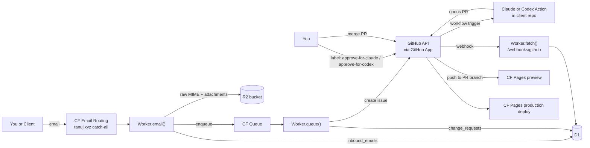

# patchline

Internal platform that turns emailed website edit requests into reviewable
GitHub issues and PRs for an SMB website agency.

A single Cloudflare Worker ingests email at `agentdev+<site>@tanuj.xyz`,
stores it in D1/R2, queues normalization, opens a GitHub issue, and reacts
to GitHub webhooks. A maintainer chooses the coding agent by adding either
`approve-for-claude` or `approve-for-codex`; the selected GitHub Action opens a
PR, Cloudflare Pages builds a preview, and a maintainer manually merges to
`main`.

No admin dashboard. GitHub Issues + PRs are the review interface.

## Architecture



Triggers are **all push, no cron**: Email Routing pushes to `email()`,
Cloudflare Queues pushes to `queue()`, GitHub pushes to `fetch()`.

## Repo layout

```
patchline/
  apps/patchline-worker/      # the Cloudflare Worker (single deploy unit)
    src/
      index.ts                # email + queue + fetch wiring only
      email/                  # parser, resolver, handler
      queue/                  # normalizer, issueBuilder, consumer (+ DLQ)
      github/                 # app auth, REST client, webhook receiver, labels
      http/                   # tiny router for fetch()
      db/                     # D1 repo (single SQL surface) + audit helper
      storage/                # R2 keys + S3 presign for attachment links
      lib/                    # ids, logger, notify, result
      types.ts                # Env bindings + domain types
    migrations/0001_init.sql
    wrangler.jsonc
  client-template/            # copy into each new client repo
    .github/workflows/claude.yml
    .github/workflows/codex.yml
    .claude/settings.json
    CLAUDE.md
    AGENTS.md
  scripts/seed.sql            # first-client D1 seed
```

## Cloudflare resources (already provisioned)

| Kind  | Name                  | Binding              |
| ----- | --------------------- | -------------------- |
| D1    | `patchline-db`        | `patchline_db`       |
| R2    | `patchline-storage`   | `patchline_storage`  |
| Queue | `patchline-jobs`      | `patchline_jobs`     |
| Queue | `patchline-jobs-dlq`  | (consumer only)      |
| Email | (Email Routing on `tanuj.xyz`) | `SEND_EMAIL` for outbound |

Queue tuning (`wrangler.jsonc`):

| Setting             | Main queue | DLQ |
| ------------------- | ---------- | --- |
| `max_batch_size`    | 1          | 1   |
| `max_batch_timeout` | 1s         | 5s  |
| `max_concurrency`   | 5          | -   |
| `max_retries`       | 3          | 0   |
| `retry_delay`       | 30s        | -   |

Rationale: 1-msg batches give near-real-time GitHub issue creation and
trivial partial-failure semantics. The DLQ is terminal: the consumer notifies
the admin and acks.

## First-time setup

Steps 1-3 are already done if you've followed the init checklist. Steps
below assume a fresh checkout.

### 1. Install + type-check

```bash
cd apps/patchline-worker
npm install
npx wrangler types
```

### 2. Push secrets

```bash
npx wrangler secret put GITHUB_APP_ID            # numeric App ID
# Pipe the .pem file in directly so newlines aren't mangled:
npx wrangler secret put GITHUB_APP_PRIVATE_KEY < ~/Downloads/your-app.YYYY-MM-DD.private-key.pem
npx wrangler secret put GITHUB_WEBHOOK_SECRET    # output of `openssl rand -hex 32`
npx wrangler secret put R2_S3_ACCESS_KEY_ID
npx wrangler secret put R2_S3_SECRET_ACCESS_KEY
```

### 3. Edit non-secret vars in `wrangler.jsonc`

Replace placeholders:

- `ADMIN_NOTIFY_EMAIL` -> a verified Email Routing destination address
  (your real personal mailbox). Tighten the `send_email` binding by adding
  `"destination_address": "..."` once stable.
- `R2_ACCOUNT_ID` -> your Cloudflare account id (used to construct the R2
  S3 endpoint for presigned URLs).

### 4. Deploy + apply migrations

```bash
npx wrangler deploy
npm run db:migrate
```

After deploy, copy the Worker URL it prints. You'll need it for step 6.

### 5. Wire Email Routing to the Worker

Cloudflare dashboard -> `tanuj.xyz` -> Email Routing -> Routes ->
**Custom addresses** -> Create address:

- Custom address: `agentdev@tanuj.xyz`
- Action: **Send to a Worker** -> `patchline-worker`

You do **not** need a catch-all. Cloudflare Email Routing supports
sub-addressing by default, so a single rule on `agentdev@tanuj.xyz`
also receives mail for `agentdev+acme@tanuj.xyz`,
`agentdev+demo@tanuj.xyz`, etc. The `+slug` is preserved in `message.to`,
which `email/resolver.ts` parses to look up the site.

Leave the catch-all set to **Drop** so typos like `info@tanuj.xyz` don't
hit the Worker only to be rejected.

### 6. Set the GitHub App webhook URL

GitHub -> Settings -> Apps -> your App -> Edit:

- Webhook URL: `https://patchline-worker.<your-subdomain>.workers.dev/webhooks/github`
- Webhook secret: matches `GITHUB_WEBHOOK_SECRET`
- Events subscribed: `Issues`, `Issue comment`, `Pull request`, `Label`

Use "Recent Deliveries" -> "Redeliver" on the ping to confirm 2xx.

### 7. Seed the first client

Edit `scripts/seed.sql` and replace the `EDIT:` placeholders. Then:

```bash
cd apps/patchline-worker
npx wrangler d1 execute patchline-db --remote --file=../../scripts/seed.sql
```

## Onboarding a new client repo

```bash
ORG=<your-gh-org-or-user>
REPO=acme-website

# 1. Create from template
gh repo create "$ORG/$REPO" --private --clone
cp -r ./client-template/. "./$REPO/"
cd "$REPO"
git add . && git commit -m "Bootstrap from patchline client-template" && git push -u origin main

# 2. Labels
for L in client-request needs-triage needs-clarification \
         approve-for-claude approve-for-codex \
         agent-running pr-opened blocked done rejected; do
  gh label create "$L" -R "$ORG/$REPO" --force
done

# 3. Agent API keys. Add only the ones you plan to use for this repo.
gh secret set ANTHROPIC_API_KEY -R "$ORG/$REPO" --body "sk-ant-..."
gh secret set OPENAI_API_KEY -R "$ORG/$REPO" --body "sk-..."

# 4. Install the GitHub App on this repo (UI). Note the installation_id.
# 5. Connect the repo to a Cloudflare Pages project; enable PR previews.
# 6. Insert rows in D1:
cd ../apps/patchline-worker
npx wrangler d1 execute patchline-db --remote --command "
  INSERT INTO clients (id, slug, name, created_at) VALUES
    ('cli_acme', 'acme', 'Acme Corp', unixepoch()*1000)
    ON CONFLICT(slug) DO NOTHING;
  INSERT INTO sites (id, client_id, slug, name, created_at) VALUES
    ('site_acme', 'cli_acme', 'acme', 'acme.com', unixepoch()*1000)
    ON CONFLICT(slug) DO NOTHING;
  INSERT INTO site_repos (id, site_id, github_owner, github_repo, github_installation_id, default_branch, allowed_globs)
    VALUES ('repo_acme', 'site_acme', '$ORG', '$REPO', <INSTALL_ID>, 'main',
            '[\"src/content/**\",\"public/images/**\"]');
"
```

## Acceptance test

1. From an `allowed_senders` address, send mail to
   `agentdev+acme@tanuj.xyz` with subject `Update phone number to (555) 123-4567`.
2. `wrangler tail` should show `email_accepted` and `issue_created`.
3. The configured client repo should have a new issue with labels
   `client-request`, `needs-triage`.
4. Add exactly one approval label:
   `approve-for-claude` to run Claude Code, or `approve-for-codex` to run
   OpenAI Codex. The selected Action runs and opens a PR.
5. The webhook updates D1 (`github_prs`, label transitions). Cloudflare
   Pages should build a preview for the PR.
6. Merge. Cloudflare Pages deploys production. Issue auto-closes via the
   webhook.

## Local development

```bash
cd apps/patchline-worker
npx wrangler dev          # serves /webhooks/github + /healthz on localhost:8787
```

`email()` and `queue()` cannot fully be exercised locally with the binding
configured for remote D1/R2; use `npm run db:migrate:local` to test against
local D1 if needed.

Useful commands:

```bash
npm run tail              # stream production logs (structured JSON)
npm run db:console "SELECT * FROM inbound_emails ORDER BY received_at DESC LIMIT 5"
```

## Operational notes

### Why a queue (not direct inline work)

Retries on transient failures (GitHub 5xx, rate limits, App token blips), a
DLQ for terminal failures, backpressure for forwarded bursts, and a clean
replay point. None of these come for free if the work runs inline in
`email()`.

### Where messages end up in the DLQ

After 3 failed normalize attempts:

- GitHub App auth failure (bad/expired private key, App uninstalled, stale
  installation id)
- GitHub API hard failure (repo archived, secondary rate limit, persistent 5xx)
- Site config drift (the inbound email points at a deleted site)
- D1 constraint violation
- R2 presign failure
- Normalizer bug or sustained outage

Policy rejects (unknown `+slug`, disallowed sender, duplicate `Message-ID`)
are **not** failures - they bounce back to the sender via `message.setReject`.

### Admin notifications

`lib/notify.ts` is the single helper for outbound admin email via the
Cloudflare `send_email` binding. Used by:

- the DLQ consumer (every terminal failure)
- the `email()` pre-persist safety net (rare D1-down case)

Debounced on `(error_class | site_slug)` over a 10-minute window so a
sustained outage doesn't flood your inbox.

### Audit trail

Every meaningful event writes to `audit_logs`:
`email_received`, `email_duplicate_ignored`, `email_sender_not_allowed`,
`issue_created`, `issue_approved`, `issue_closed`, `pr_opened`,
`pr_closed`, `notify_sent`, `notify_debounced`, `dlq_received`.

Query examples:

```bash
# All events for a request
npm run db:console "SELECT actor, event, occurred_at FROM audit_logs WHERE request_id = 'req_...' ORDER BY occurred_at"

# Recent DLQ hits
npm run db:console "SELECT * FROM audit_logs WHERE event = 'dlq_received' ORDER BY occurred_at DESC LIMIT 20"
```

## v1 supported edit types

`replace_text`, `replace_image`, `remove_image`, `update_phone`,
`update_email`, `update_hours`, `update_address`, `add_content_item`,
`remove_content_item`, `add_asset`. Anything else becomes `unknown` and
gets the `needs-clarification` label so a human can rewrite the issue.

## Out of scope for v1

Admin dashboard, client portal, automated client onboarding script,
Bash-tool execution by Claude, automatic attachment commits to the repo
(presigned URLs in the issue body instead), multi-repo changes from one
request, scheduled retries beyond the queue's built-in.
